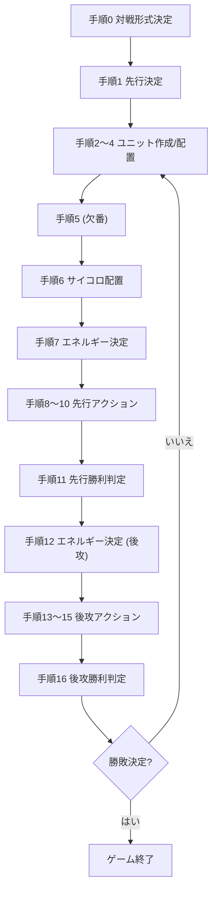

# 関数仕様リファレンス

主要ロジックの関数を整理し、役割・引数・戻り値をまとめる。型名は TypeScript の定義（`src/types.ts`）に準じる。

---

## 1. ルール・ボード計算

### `computeLegalMoves(unit, board, wrap)`
- **役割**: 指定ユニットが現在位置から移動可能なセルを計算する。
- **引数**
  - `unit: Unit` – `position` を持つユニット。配置されていない場合は空配列を返す。
  - `board: Map<BoardCell, Unit>` – 盤面配置マップ。
  - `wrap: boolean` – 盤面端をラップ移動するか（魔術師など）。
- **戻り値**: `BoardCell[]` – 自軍の駒を避けた到達可能セル。兵種別（ドラゴン / グリフォン / ユニコーン）の移動ルールを内部で適用。

### `buildBoardMap(units)`
- **役割**: `Unit[]` から `Map<BoardCell, Unit>` を構築。`status === 'deployed'`（または `tentative`）の駒のみ配置する。
- **引数**: `units: Unit[]`
- **戻り値**: `Map<BoardCell, Unit>`

---

## 2. 手順・アクション進行

### `getActivePlayerForStep(step, leadingPlayer)`
- **役割**: 現在手順で行動するプレイヤーを算出。
- **引数**
  - `step: ProcedureStep`
  - `leadingPlayer: PlayerId`
- **戻り値**: `'A' | 'B'`

### `canAdvanceStep(params)`
- **役割**: 各手順で「手順完了」ボタンを有効化できるか判定。配置・ダイス配置・アクション進行状況などをチェック。
- **引数**: `{ step, diceRedistribution, placementState, pendingCreations, pendingPlacementCount, dicePlacementStage, movementState, nextActions, activeStepPlayer }`
- **戻り値**: `boolean`

### `startDiceRoll({ player, action, dice, launchRoll, onMovementStart })`
- **役割**: 指定プレイヤーが使用するサイコロをセットし、`movementState` を初期化。
- **引数**
  - `player: PlayerId`
  - `action: ActionType`
  - `dice: DiceType[]`
  - `launchRoll: (dice) => { budget: MovementBudget }` – Three.js/Cannon の演出を起動し、停止後に予算を返す。
  - `onMovementStart: (state: MovementState) => void`
- **戻り値**: `void`

### `executeAction(params)`
- **役割**: 現在の手順に期待されるアクション（通常 / 作戦 / 起死回生）と `nextActions` を照合し、サイコロ配置または再配置を進める。
- **引数**: `{ step, activePlayer, nextActions, movementState, diceSlots, gatherDiceTypes, onStartRoll, setDiceSlots, openRedistribution, setRedistributionChoice }`
- **戻り値**: `void`
- **処理概要**
  1. `getActionTypeForStep(step)` で必要な行動を取得。
  2. `nextActions[activePlayer] !== actionType` ならキャンセル（音声 `cancel`）。
  3. `gatherDiceTypes(actionType)` で必要ダイスを取得し `onStartRoll` に渡す。
  4. 行動種別に応じて `diceSlots` をローテーション、または再配置モーダルを開く。

---

## 3. ステート管理用カスタムフック

### `useGameState()`
- **役割**: ゲーム全体の状態（プレイヤー、ユニット、手順、対戦モード、ログ、通信）を管理。
- **主な戻り値**: `players`, `units`, `step`, `leadingPlayer`, `placementState`, `movementState`, `actionSelection`, `nextActions`, `creationRequest`, `creationSelection`, `miniBoardState`, `nameStage`, `nameDrafts`, `nameLocks`, `initiativeChoice`, `victor`, `boardMap`, `remainingByClass`, `activePlacementUnits`, `currentPlacementTargets`, `creationRemaining`, `activeMovementUnits`, `diceSlots`, `dicePlacementStage`, `diceRedistribution`, `setPlayers`, `setUnits`, `setStep` … など多岐に渡る。
- **副作用**: 手順進行に応じた自動遷移、P2Pログ同期、観戦モードでのスナップショット適用など。

### `useMovementLogic(options)`
- **役割**: `movementState` の生成・更新・完了処理を集約。
- **戻り値**: `{ movementState, setMovementState, activeMovementUnits, handleSelectUnitForMovement, handleMoveUnit, resetMovementState }`
- **ポイント**: 兵種別移動可能数、移動制限（策略1回 / 起死回生2回）チェック、移動完了時のログ記録 (`logAction`) を含む。

### `useUnitLogic()`
- **役割**: ユニット作成/配置/入れ替え/除去を管理。
- **戻り値**: `players`, `units`, `placementState`, `creationRequest`, `miniBoardState`, `handleCreateUnit`, `handlePlaceUnit`, `handleSwapSelection`, `toggleSwapMode`, `handleMiniBoardClick`, `handleRemoveUnit`, `finalizeTentativePlacements` など。
- **特徴**: 配置操作はログとして記録され、通信モードでは相手に同期される。

### `useDiceState()`
- **役割**: サイコロスロット（R1〜R3）と再配置処理を管理。
- **戻り値**: `{ diceSlots, dicePlacementStage, diceRedistribution, redistributionChoice, setRedistributionChoice, setDiceRedistribution, setDiceSlots, placeDie, gatherDiceTypes, completeRedistribution, resetDiceState }`

---

## 4. 通信・ログ

### `usePeerTransport()`
- **役割**: PeerJS を用いたP2P通信の初期化、接続、ログ配信／受信を担う。
- **主な戻り値**: `peerId`, `status`, `initializePeer`, `connectToPeer`, `broadcast`, `sendHandshake`, `setLatestLogs`, `setLogHandler`, `setHandshakeHandler`

### `useGameLog()`
- **役割**: ログの保存・ダウンロード／アップロード・再生制御。
- **戻り値**: `logs`, `recordLog`, `downloadLogs`, `handleUpload`, `uploadedLogs`, `canReplay`, `replayFromLogs`, `isCollapsed`, `toggleCollapsed`, `isReplaying`

`useGameState` では `usePeerTransport` と連携し、`broadcast` でログを送信、`setLogHandler` で受信時に `handleReplayLogs` を呼び出して差分のみ適用する。

---

## 5. 主要フローチャート

通信モードでは、各ステップのログが `useGameLog` / `usePeerTransport` を通じて配信され、手番外プレイヤーや観戦ブラウザはログを受け取って状態を再生する。

---

## 補足

- いずれの関数/フックも React Hooks を組み合わせており、副作用 (`useEffect`) によって手順の自動スキップや通信同期が行われる。
- 型定義 (`src/types.ts`) は最新の仕様（手順0、対戦モード、ログ同期など）に合わせて更新済み。
