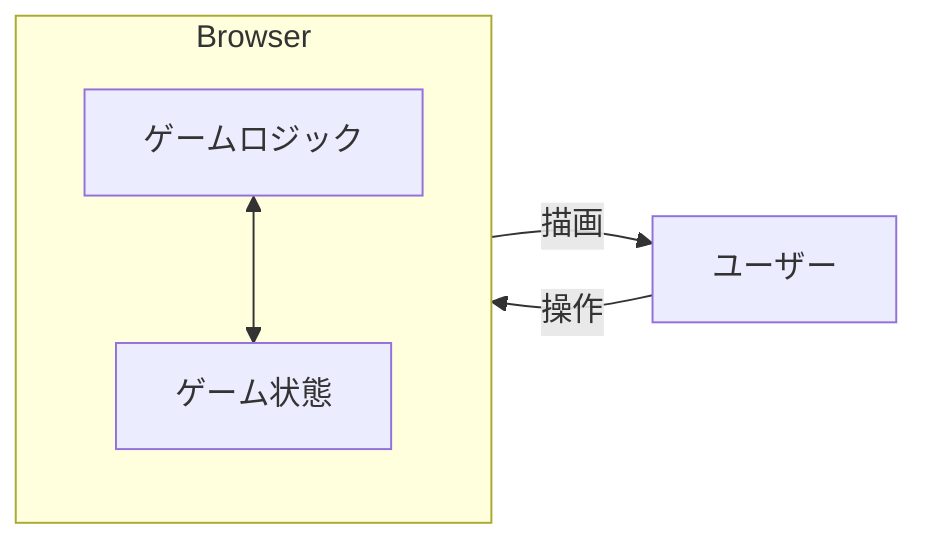
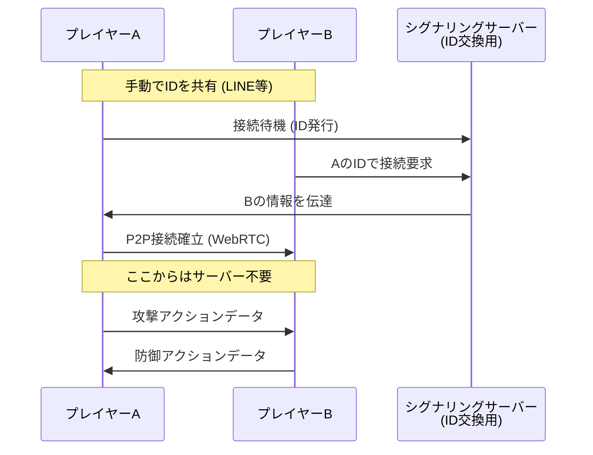

# 幻獣闘技 (Phantom Beast Fighting) のブラウザ間P2P通信設計に関する説明

このドキュメントでは、ブラウザ間P2P通信を利用した対戦カードゲーム「幻獣闘技」の機能と、それを支える技術アーキテクチャについて解説します。

## 📱 アプリケーション概要

本アプリは、専用のサーバーを介さずに（シグナリングを除く）、ブラウザ同士が直接通信することでリアルタイムな対戦および観戦を実現するカードゲームです。

**主な特徴:**

* インストール不要（ブラウザのみで動作）
* 中央サーバー不要のP2P対戦
* 柔軟な観戦機能（観戦のリレーが可能）

---

##  3つの動作モードと仕組み

このアプリには3つのモードがあり、それぞれ通信の有無やデータの流れが異なります。

### 1. 1ブラウザで対戦 (Local Mode)

通信を行わず、1つのブラウザ内で完結するモードです。動作確認や一人遊び用と推測されます。

* **仕組み:** ゲームロジック、UI描画、状態管理がすべて同一メモリ空間で行われます。
* **通信:** なし。



### 2. 通信で対戦 (Remote Battle Mode)

離れた場所にいるユーザー同士が、P2P接続を確立して対戦するモードです。

* **仕組み:**
1. **ID交換 (シグナリング):** 片方のユーザーが発行した「接続ID」を、LINEやDiscordなどの別ツールで相手に送ります。
2. **P2P接続:** PeerJS等のWebRTCラッパーを利用し、ブラウザ間でデータコネクションを確立します。
3. **データ同期:** カードの選択やターンの進行などの「アクションデータ（ログ）」を相互に送信し、お互いのブラウザで同じゲーム状態を再現します。




### 3. 対戦を観戦 (Spectator Mode)

このアプリの最もユニークな機能です。対戦中のプレイヤー、あるいは「既に観戦している人」に接続して、試合を見ることができます。

* **仕組み (リレー方式):**
* 観戦者は、プレイヤー（または他の観戦者）から送られてくる「対戦ログ（操作履歴）」を受け取ります。
* 受け取ったログを自分のブラウザ内のゲームロジックに入力することで、対戦画面を**ミラーリング（再現）**します。
* **観戦の連鎖:** 観戦者は、自分が受け取ったデータをさらに「別の観戦者」に横流し（リレー）することができます。これにより、配信者のPC負荷を分散させつつ、多人数での観戦が可能になります。


```mermaid
graph TD
    P1[プレイヤーA<br>(ホスト)] <-->|対戦データ| P2[プレイヤーB]
    
    P1 -.->|ログ送信| S1[観戦者1]
    P1 -.->|ログ送信| S2[観戦者2]
    
    S1 -.->|ログ中継| S3[観戦者3]
    S3 -.->|ログ中継| S4[観戦者4<br>(孫請け)]
    
    style P1 fill:#f9f,stroke:#333
    style P2 fill:#f9f,stroke:#333
    style S1 fill:#ccf,stroke:#333
    style S3 fill:#ccf,stroke:#333
    style S4 fill:#ccf,stroke:#333

```

---

## 使用技術とアーキテクチャ
。

### 1. 通信レイヤー: WebRTC (PeerJS)

* **役割:** ブラウザ間のNAT越えとデータ通信。
* **実装:** `PeerJS` ライブラリを使用。
* **DataChannel:** 映像ではなく「ゲームの操作データ（JSONなど）」を送るため、`RTCDataChannel` を利用しています。これにより遅延の少ない同期が可能です。


### 2. データ同期方式: Event Sourcing 

* **役割:** 離れたブラウザ間でゲーム画面を一致させる。
* **手法:** 画面そのものを映像で送るのではなく、「AがカードXを出した」という**コマンド（イベントログ）**だけを送信しています。
* **メリット:** 通信量が極めて少ない（テキストデータのみ）。
* **メリット:** 受信側で再描画するため、解像度が劣化しない。


### 3. フロントエンド

* **状態管理:** 対戦モードと観戦モードで、同じ「ゲーム処理コア」を使い回す設計になっています。
* 対戦モード：入力を「相手に送信」しつつ「自分に反映」
* 観戦モード：入力を「受信」して「自分に反映」しつつ「他に転送」


---

## このアプリから学べるP2P設計のポイント

1. **シグナリングのコスト削減:**
* オートマッチング（ロビー機能）を作ると常時稼働するDBサーバーが必要になりますが、このアプリは「IDを人間がコピペする」運用にすることで、インフラコストを最小限（PeerJSの無料サーバーのみ）に抑えています。


2. **P2Pリレーによる配信:**
* 通常、1人が100人にデータを送るとパンクしますが、「観戦者が観戦者を呼ぶ」数珠つなぎの構造にすることで、配信元の負荷を上げずに規模を拡大できるP2P CDNのような仕組みを取り入れています。
